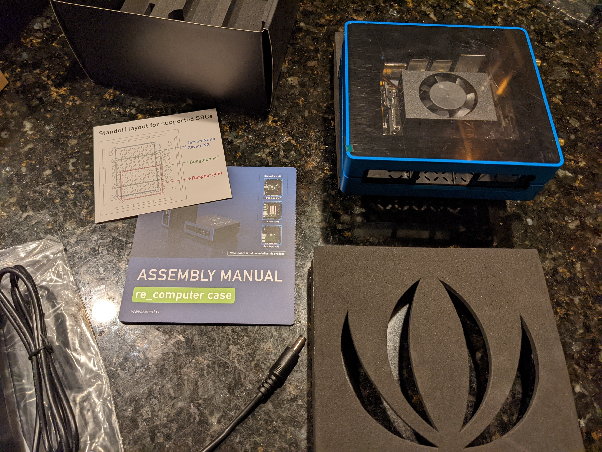

# Nvidia Jetson Xavier-NX

## Preamble
So - I kind of hate to start off a write-up with a bunch of negative stuff, but... this experience has kind of sucked thus far (and for once, I don't think COVID is to blame).


## First Impressions
### Seeed Studio
The first part is regarding the "up-lift" of the Xavier by Seeed Studio.  I ordered the following for $849:  
`Jetson SUB Mini PC-Blue with Jetson Xavier NX module, Aluminium case with cooling fan, 128GB SSD, WiFi, Antennas and pre-installed JetPack System`    



I probably should have paid more attention to the fact that there was no "Shipping and Handling" charge.  I have to admit that Seeed shipped it much sooner than they initially had quoted.  

### DHL Express
After a day or two, I get a notification (SMS/text) from DHL saying I owed them $257.00 - huh?  I think it's SPAM, at first.  But then I confirm it's a legit message.  I click through on DHL's horrible website and the only info I can find is that there are 3 things I have to pay for:
Import Export Duties: 212.25
Advance payment:  17.00
Merchandize Processing: 27.75

So - before I go any futher, Seeed will likely never get my money ever again.  I have bought laptops, 4 other Jetson, etc.. and never had this issue.  
DHL is borderline criminal for how they handle this.  I did not ask them to prepay my Duty, that is their choice.  So, they optioned to act as the agent and *then* charge me for it, without any prior agreement on my part. (Google "DHL duty lawsuit" and decide for yourself, I guess).  
OK - so, I buried the link to the Seeed Page down here to ensure you have a better idea of what surprises you may encounter  
[Jetson SUB Mini PC-Blue with Jetson Xavier NX module, Aluminium case with cooling fan, 128GB SSD, WiFi, Antennas and pre-installed JetPack System](https://www.seeedstudio.com/Jetson-SUB-Mini-PC-Blue-p-5212.html)

## Things that matter...
Seeed bundles the Nvidia Jetson Xavier NX in a Case (with wifi, SSD, pre-installed Nvidia Jetpack).  It's actually fairly cool looking and a great idea.  
I notice some similarities with the Jetson Nano Devkit(s) I already have.  The ports/connectivity appear to be the same.

### Module Fan
The "processor fan" is flat/tight up against the clear case top (inevitably reducing the cooling by a significant amount - I have not yet decided how I will handle this.
### The Case bundle

### The micro-USB port
I have an micro-USB cable from Nvidia from my Nvidia TV and it barely can be inserted in to the Jetson.  Hopefully that will not be an issue

### Ethernet (RJ45) Jack
I inserted a cable which has a fairly typical guard/flap over the retainer piece - the placement in the case makes it almost impossible to press the retainer to remove the cable.  Yay.

## First Boot
Of course, and as expected, the Ubuntu install boots and runs like a champ.  


## Hardware Control
I will most often be running my Xavier headless.  I statically assign an IP address via DHCP once I discover the MAC address and I will also use a USB cable connected to my Fedora laptop

### Check device (from laptop)
```
$ lsusb | grep -i nvidia
Bus 001 Device 005: ID 0955:7020 NVIDIA Corp. L4T (Linux for Tegra) running on Tegra
```

### Modify fan speed
NOTE:  the path to the "fan control" seems to differ based on a number of factors
```
$ sudo su - -c "echo 128 > /sys/devices/pwm-fan/target_pwm"
```

### Display memory
```
$ free -g
              total        used        free      shared  buff/cache   available
Mem:              7           0           6           0           0           6
Swap:             3           0           3
```
