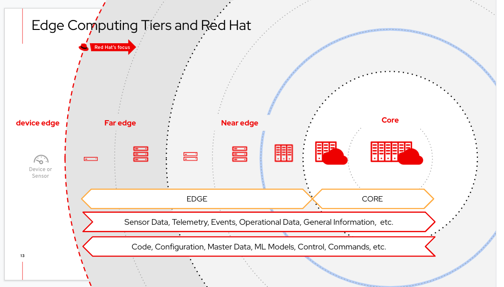
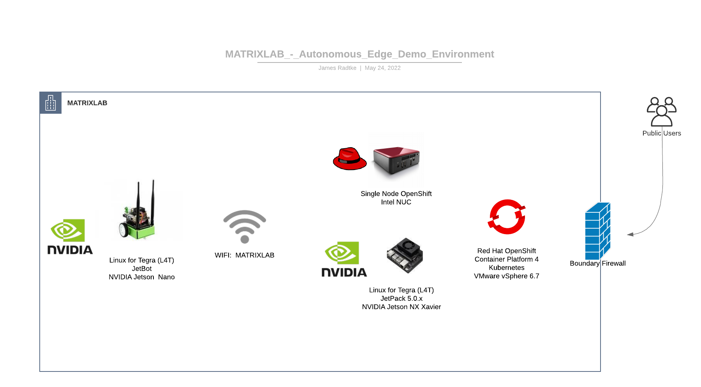
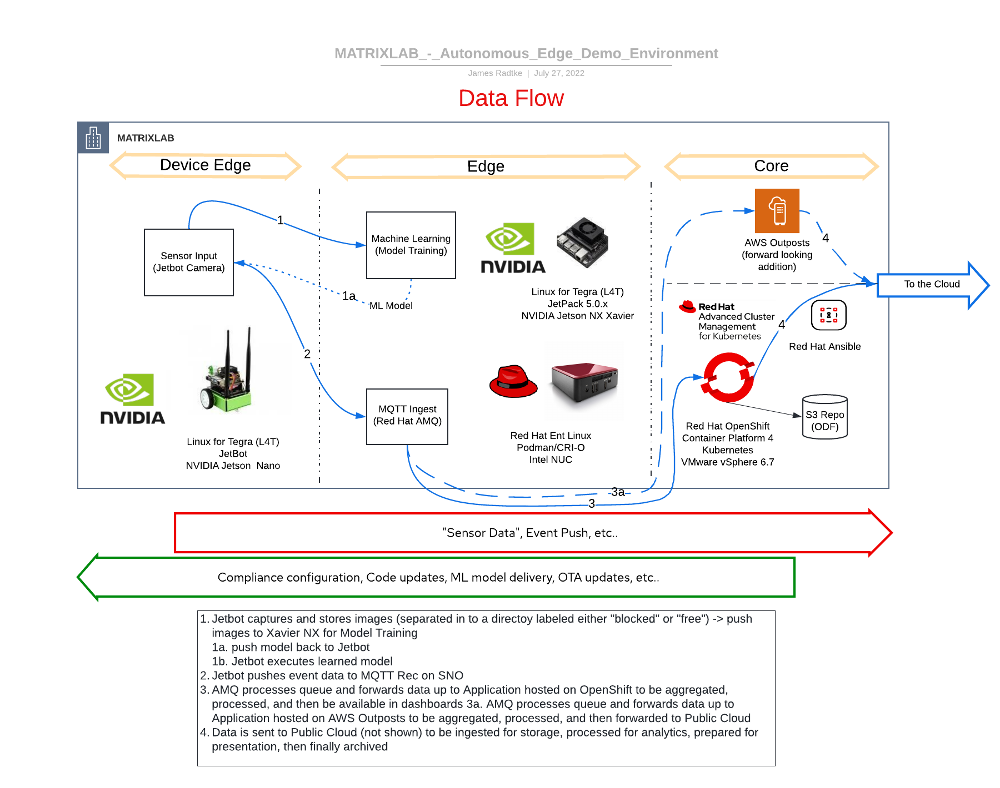
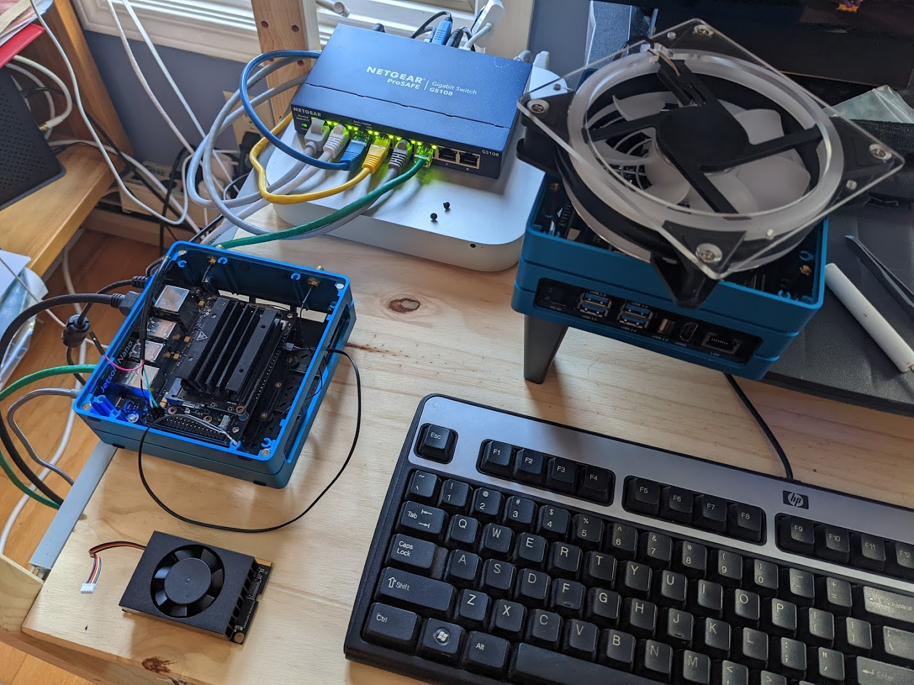
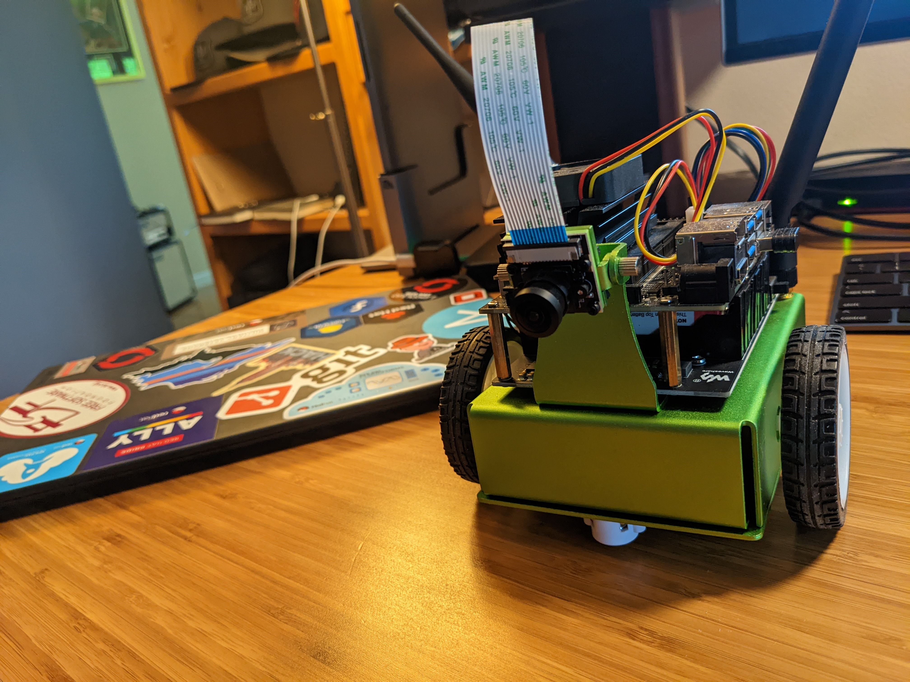

# jetsons.lab
NVIDIA Jetson Lab Environment - exploring Autonomous Edge Compute 

## Overview
I would like to deploy "Kubernetes" of some sort on small form factor devices.  Since I don't have an Industrial Manufacturing Facility nor remote Cell Towers handy, I have devised a representative mockup.  

Starting with the "Data Center" and moving towards the Edge:
* Data Center
  * Red Hat OpenShift Cluster 
* "Edge" (simulated)
  * Red Hat SingleNode OpenShift on Intel NUC
  * NVIDIA Jetson Xavier NX
* Device Edge
  * NVIDIA Jetson / Waveshare Jetbot

The following images should help visualize what we are trying to accomplish:

  

### But what will it do?
This time starting at the Edge and moving towards the Data Center:

At the Device Edge, the Waveshare Jetbot is a customized ROM based on NVIDIA Jetpack 4.6 - it is a small form factor AI/ML platform which will be using the [Jetbot Collision Avoidance](https://jetbot.org/master/examples/collision_avoidance.html) Notebook which will have been trained in my "lab".  The Jetbot will be fully autonomous once trained and will (should?) continue doing it's thing until the battery dies.  It's thing = driving around in an area, avoiding the "walls" I create on the floor.  The training will be accomplished by grabbing situational images where the Jetbot is either "blocked" or "free" and loading them in to separate directories.  Those images will be transfered to the NVIDIA Jetson Xavier NX for Machine Learning Processing.  The output will then be loaded on the Jetbot to make it (hopefully) autonomous at that point.

Next, the Edge (Far Edge/Near Edge) will be the focus where additional compute will accept feedback from the Device Edge - Jetbot regarding the environmental situations it encounters (avoidance events, etc...)  This will be accomplished by [Single Node OpenShift Cluster](https://docs.openshift.com/container-platform/4.10/installing/installing_sno/install-sno-installing-sno.html) running [Red Hat AMQ](https://www.redhat.com/en/technologies/jboss-middleware/amq) and [Apache Kafka](https://kafka.apache.org/) using [MQTT protocol](https://en.wikipedia.org/wiki/MQTT) to communicate.

Lastly, the Data Center will host [Red Hat OpenShift](https://www.redhat.com/en/technologies/cloud-computing/openshift) which will accept the aggregated data from the Edge tier for presentation, archival, additional processing, etc...  (I haven't exactly figured out exactly what all this tier will entail)

### Data Path
Jetbot grabs images -> push images to Xavier NX for Model Training -> push model back to Jetbot  
Jetbot pushes event data to MQTT Rec on SNO ->  (TBC...)

## Get after it
There's little/no point in my explaining how to make your Jetson bootable, as it's all detailed in the following overview:    
https://developer.nvidia.com/embedded/learn/get-started-jetson-nano-devkit#intro

### How it started...

### How it's going...  

## Notes
[Fog Computing](https://en.wikipedia.org/wiki/Fog_computing) was a consideration for this, but there is not much to differentiate my workloads for this Demo Environment.  I believe in a more "real world" implementation of something like this Fog would be much more relevant.

## References and Credits
Image (above) "Edge Computing Tiers and Red Hat" -- Luis Arizmendi, Principal Edge Computing Specialist Solution Architect (from: Red Hat Enterprise Linux for Edge - Technical Intro)

[NVIDIA Jetpack - Software Development Kit (SDK)](https://developer.nvidia.com/embedded/jetpack)  
[NVIDIA Jetson Nano Dev Kit](https://developer.nvidia.com/embedded/jetson-nano-developer-kit)  
[NVIDIA Jetson Xavier NX](https://www.nvidia.com/en-us/autonomous-machines/embedded-systems/jetson-xavier-nx/)  
[Jetbot AI/ML Project](https://jetbot.org/master/index.html)  
[Waveshare Jetbot](https://jetbot.org/master/third_party_kits.html)  
  
[Red Hat OpenShift](https://www.redhat.com/en/technologies/cloud-computing/openshift)  
[Red Hat OpenShift - Single Node OpenShift](https://docs.openshift.com/container-platform/4.10/installing/installing_sno/install-sno-preparing-to-install-sno.html)  
[Red Hat AMQ](https://www.redhat.com/en/technologies/jboss-middleware/amq)  
[Apache Camel-K (Camel Kafka)](https://camel.apache.org/camel-k/1.9.x/index.html)  
[Apache Kafka](https://kafka.apache.org/)  
[Apache Kafka MirrorMaker](https://docs.confluent.io/4.0.0/multi-dc/mirrormaker.html)  
[MQTT Protocol](https://en.wikipedia.org/wiki/MQTT)  
