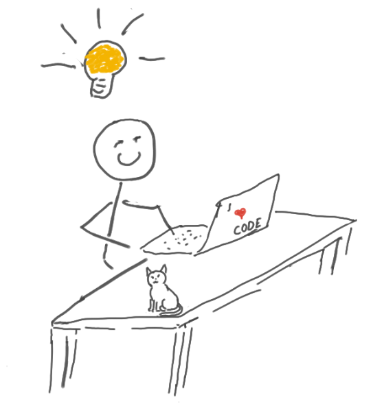

# jetsons.lab

NVIDIA Jetson Lab Environment - exploring Autonomous Device Edge Compute with Edge devices, Middleware queing and processing, and downstream dashboard presentation with additional processing in the Data Center.  At a later phase (Q4 2022) the plan is to introduce public cloud (AWS) for additional analytics and machine learning, reporting, executive dashboards, etc..

## Overview
First/foremost this lab is an entirely fictitous use-case and scenario.  It is a "Data Science" project with an emphasis on Data Engineering, that will integrate MLOps.

## Status  
| Timeline | Status Overview |
|:---------|:----------------|
| 2024-Q1  | Revisiting and refactoring to use EKS - This needs a LOT of work to be updated |
| 2022-Q3  | This is very much still a work in progress |
| 2022-Q2  | Initial Draft   Researching hardware platforms and compute options |

## The Challenge 
Short version: a manufacturer needs to have an app deployed at "the edge" to run autonomous devices.  

The manufacturing floor has many "manual" or "human-driven" aspects, even when autonomous systems are involved.  There is need/want to modernize the software stack and migrate from proprietary and slow-changing software implementation, to utilize more commodity off the shelf (COTS) hardware and Open Source Software (OSS) and modern Software Development Methodologies.  The benefits of working through this activity will be realized in a number of different areas in the business.

## Technical Objective 
Deploy a ["Container-based workload"](https://cloud.google.com/learn/what-are-containers) of some sort on small form factor devices to resemble a typical manufacturing environment.  (Since I don't have an Industrial Manufacturing Facility nor remote Cell Towers handy, I have devised a representative mockup.)

Starting with "the cloud", to the "Data Center" and moving towards the Edge:
* Cloud (public)
  * Amazon EKS
  * Cloud-native services
    * S3 object storage
* Data Center
  * 3-node Intel NUC
    * EKS Anywhere
* "Edge" (simulated) (AKA "Far Edge" or "Near Edge")
  * Intel NUC - Ubuntu 22.04 "Admin Host"
  * NVIDIA Jetson Xavier NX - Linux for Tegra (L4T)
* Device Edge
  * NVIDIA Jetson - Waveshare Jetbot Software

### Functions/Tools/Services
This solution will provide DevSecGitOps: (reword this <<< )

| Function                             | Product (proposed)
|:-------------------------------------|:-----------------------------------|
| Source Control Management (SCM)      | [GitHub](https://github.com/)      | 
| Container Registry                   | [Amazon ECR](https://aws.amazon.com/ecr)   [DockerHub](https://hub.docker.com/) |
| Binary/Package Repository            | [Nexus](https://www.sonatype.com/products/nexus-repository)
| Container Hosting (Cloud)            | [EKS](https://aws.amazon.com/eks/)
| Container Hosting (on-prem)          | [EKS Anywhere (EKS-A](https://aws.amazon.com/eks/eks-anywhere/)
| Platform Scanning                    | [TBD - maybe Sysdig?](https://sysdig.com/s-kubernetes-security-guide)
| Container Scanning                   | [Aqua Trivy](https://github.com/aquasecurity/trivy)
| Container Orchestration              | [ArgoCD](https://argo-cd.readthedocs.io/en/stable/) |
| Code Scanning (static code analysis) | [Sonarqube](https://www.sonarqube.org/) | 
| Code Testing                         | [Selinium](https://www.selenium.dev/) | 
| Chat Integration                     | [Slack](https://slack.com/) | 
| Infrastructure Automation and Orchestration            | [Red Hat Ansible Automation Platform](https://www.redhat.com/en/technologies/management/ansible)

### Considerations:

* Need to find products to fill the empty spots (above)
* Determine which products work in both on-prem and cloud
* Analyze cloud-native vs vendor-apps  

## Executive Summary
We will be creating Infrastructure to accommodate a secure software pipeline from the time a developer commits code in to a Repo to when it's running on an Edge or Far Edge device.  Additionally, we will introduce rigor and testing in to the SDLC.

The following images should help visualize what we are trying to accomplish:

### Autonomous Edge Environment 

### But what will it do?
The following will provide an overview of the funcationality, starting at the Device Edge, to the Edge, to the Data Center, to the Cloud:

At the Device Edge, the Waveshare Jetbot is a customized ROM based on NVIDIA Jetpack 4.6 - it is a small form factor AI/ML platform which will be using the [Jetbot Collision Avoidance](https://jetbot.org/master/examples/collision_avoidance.html) Notebook which will have been trained in my "lab".  The Jetbot will be fully autonomous once trained and will (should?) continue doing it's thing until the battery dies.  It's thing = driving around in an area, avoiding the "walls" I create on the floor.  The training will be accomplished by grabbing situational images where the Jetbot is either "blocked" or "free" and loading them in to separate directories.  Those images will be transfered to the NVIDIA Jetson Xavier NX for Machine Learning Processing.  The output will then be loaded on the Jetbot to make it (hopefully) autonomous at that point.

Next, the Edge (Far Edge/Near Edge) will be the focus where additional compute will accept feedback from the Device Edge - Jetbot regarding the environmental situations it encounters (avoidance events, etc...)  This will be accomplished by an Intel NUC running RHEL 8 with Podman.  This host will be running [Red Hat AMQ](https://www.redhat.com/en/technologies/jboss-middleware/amq) and [Apache Kafka](https://kafka.apache.org/) using [MQTT protocol](https://en.wikipedia.org/wiki/MQTT) to communicate.

Next, the Data Center will host [Red Hat OpenShift](https://www.redhat.com/en/technologies/cloud-computing/openshift) which will accept the aggregated data from the Edge tier for presentation, archival, additional processing, etc...  (I haven't exactly figured out exactly what all this tier will entail)

All of this data will then be sent to a "private AWS instance" for processing.  Once the analysis has been done, the resulting data will then be forwarded to another AWS account which is responsible for presentation of the data.

### Data Flow 

1. Jetbot captures and stores images (separated in to a directoy labeled either "blocked" or "free") -> push images to Xavier NX for Model Training  
1a. push model back to Jetbot  
1b. Jetbot executes learned model   
2. Jetbot pushes event data to MQTT Rec on SNO  
3. AMQ processes queue and forwards data up to Application hosted on OpenShift to be aggregated, processed, and then be available in dashboards
3a. AMQ processes queue and forwards data up to Application hosted on AWS Outposts to be aggregated, processed, and then forwarded to Public Cloud 
4.  Data is sent to Public Cloud (not shown) to be ingested for storage, processed for analytics, prepared for presentation, then finally archived

NVIDIA created an environment to process [Advanced Photon Source (APS) data](https://www.aps.anl.gov/) - and I am (sort of) attempting to mimic that.   
  
Credit: https://developer.nvidia.com/blog/facing-the-edge-data-challenge-with-hpc-ai/

### Hub and Spoke Cluster Management (OCP)

### Software Landscape

## Get after it
There's little/no point in my explaining how to make your Jetson bootable, as it's all detailed in the following overview:    
[NVIDIA Jetson Nano Devkit - Get Started](https://developer.nvidia.com/embedded/learn/get-started-jetson-nano-devkit#intro)  
[NVIDIA Jetson Xavier NX Devkit - Get Started](https://developer.nvidia.com/embedded/learn/get-started-jetson-xavier-nx-devkit)

## Notes
[Fog Computing](https://en.wikipedia.org/wiki/Fog_computing) was a consideration for this, but there is not much to differentiate my workloads for this Demo Environment - in particular, since most of this Demo is "emulating" something else to begin with.  I believe in a more "real world" implementation of something like this Fog would be much more relevant.

I have not found a definitive guide regarding "edge nomenclature" and where in the spectrum devices exist.  As such, I am using the definitions my coworkers have adopted currently (2022 Spring).  While I don't think it is important to actually know the definitions, it does help explain my Demo Environment.

## References and Credits
Image (above) "Edge Computing Tiers and Red Hat" -- Luis Arizmendi, Principal Edge Computing Specialist Solution Architect (from: Red Hat Enterprise Linux for Edge - Technical Intro)

[NVIDIA Jetpack - Software Development Kit (SDK)](https://developer.nvidia.com/embedded/jetpack)  
[NVIDIA Jetson Nano Dev Kit](https://developer.nvidia.com/embedded/jetson-nano-developer-kit)  
[NVIDIA Jetson Xavier NX](https://www.nvidia.com/en-us/autonomous-machines/embedded-systems/jetson-xavier-nx/)  
[Jetbot AI/ML Project](https://jetbot.org/master/index.html)  
[Waveshare Jetbot](https://jetbot.org/master/third_party_kits.html)  
  
[Red Hat OpenShift](https://www.redhat.com/en/technologies/cloud-computing/openshift)  
[Red Hat OpenShift - Single Node OpenShift](https://docs.openshift.com/container-platform/4.10/installing/installing_sno/install-sno-preparing-to-install-sno.html)  
[Red Hat AMQ](https://www.redhat.com/en/technologies/jboss-middleware/amq)  
[Apache Camel-K (Camel Kafka)](https://camel.apache.org/camel-k/1.9.x/index.html)  
[Apache Kafka](https://kafka.apache.org/)  
[Apache Kafka MirrorMaker](https://docs.confluent.io/4.0.0/multi-dc/mirrormaker.html)  
[MQTT Protocol](https://en.wikipedia.org/wiki/MQTT)  

