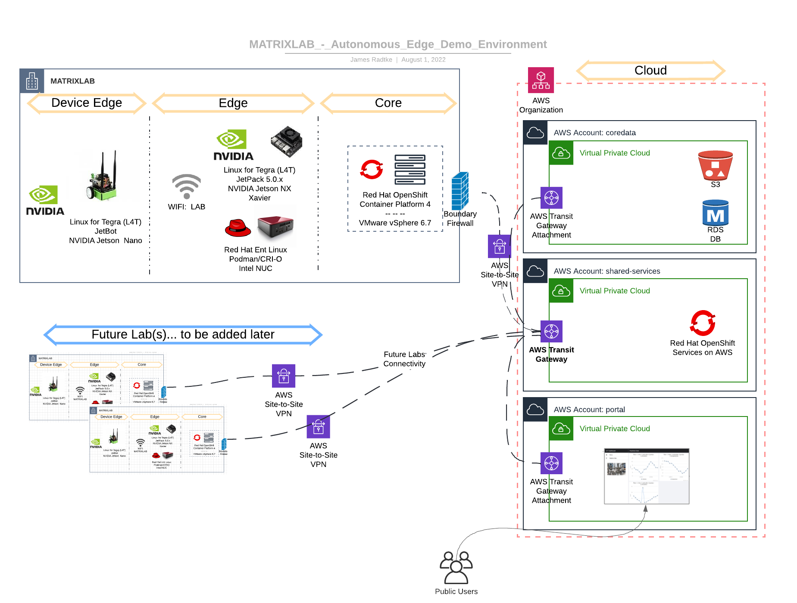

# jetsons.lab
NVIDIA Jetson Lab Environment - exploring Device Edge Autonomous Compute with Edge Middleware Queing and Processing, and downstream Dashboard Presentation with additional processing in the Data Center.

## The Problem
We need an app deployed at the Edge.  

Our manufacturing floor has many "manual" or "human-driven" aspects.  We need/want to modernize and migrate from proprietary and slow-changing software implementation, to utilize more commododity of the shelf (COTS) hardware and Open Source Software (OSS).  

A significant/looming challenge: to deploy an autonomous device to our manufacturing floor.  This device needs to be self-sustained and have the ability to be updated (and somewhat frequently), with minimal interruption.  We also need to modernize our Software Development Life Cycle (SDLC), using a secure pipeline.  We feel that once we have worked on this issue, we will be poised to address other challenges in a simliar way.

## Overview
I would like to deploy "Kubernetes" of some sort on small form factor devices representative of what a Manufacturer might do.  Since I don't have an Industrial Manufacturing Facility nor remote Cell Towers handy, I have devised a representative mockup.  

Starting with the "Data Center" and moving towards the Edge:
* Data Center
  * Red Hat OpenShift Cluster 
* "Edge" (simulated) (AKA "Far Edge" or "Near Edge")
  * Red Hat SingleNode OpenShift on Intel NUC
  * MicroShift (based on Red Hat OpenShift) on Intel NUC
  * NVIDIA Jetson Xavier NX
* Device Edge
  * NVIDIA Jetson / Waveshare Jetbot

This solution will provide DevSecGitOps: (reword this <<< )
| Function                           | Product (proposed)
|:-----------------------------------|:-----------------------------------|
| Source Control Management (SCM)    | [GitHub](https://github.com/)      | 
| Container Registry                 | [Red Hat Quay](https://access.redhat.com/products/red-hat-quay) | 
| Binary/Package Repository          | [Nexus](https://www.sonatype.com/products/nexus-repository)
| Container Hosting                  | [Red Hat OpenShift](https://www.redhat.com/en/technologies/cloud-computing/openshift) | 
| Platform Scanning                  | [Red Hat OpenShift - Compliance Operator](https://access.redhat.com/documentation/en-us/openshift_container_platform/4.10/html/security_and_compliance/compliance-operator) | 
| Container Scanning                 | [Red Hat Advanced Cluster Security](https://www.redhat.com/en/technologies/cloud-computing/openshift/advanced-cluster-security-kubernetes)
| Container Orchestration            | [ArgoCD](https://argo-cd.readthedocs.io/en/stable/) Red Hat OpenShift GitOps | 
| Pipeline Automation                | [Tekton](https://tekton.dev/)  Red Hat OpenShift Pipline | 
| Code Scanning                      | tbd - Sonarqube? | 
| Code Testing                       | tbd - Selinium? | 
| Chat Integration                   | tbd - Slack though | 
| Automation - Edge Image Building   | tbd | 

### Considerations:
Tekton vs Jenkins

### NOTE:  
I have not found a definitive guide regarding "edge nomenclature" and where in the spectrum devices exist.  As such, I am using the definitions my coworkers have adopted currently (2022 Spring).  While I don't think it is important to actually know the definitions, it does help explain my Demo Environment.

The following images should help visualize what we are trying to accomplish:

### Autonomous Edge Demo Environment - Hardware Overview (showing Edge Compute Tiers)

### But what will it do?
Starting at the Edge and moving towards the Data Center:

At the Device Edge, the Waveshare Jetbot is a customized ROM based on NVIDIA Jetpack 4.6 - it is a small form factor AI/ML platform which will be using the [Jetbot Collision Avoidance](https://jetbot.org/master/examples/collision_avoidance.html) Notebook which will have been trained in my "lab".  The Jetbot will be fully autonomous once trained and will (should?) continue doing it's thing until the battery dies.  It's thing = driving around in an area, avoiding the "walls" I create on the floor.  The training will be accomplished by grabbing situational images where the Jetbot is either "blocked" or "free" and loading them in to separate directories.  Those images will be transfered to the NVIDIA Jetson Xavier NX for Machine Learning Processing.  The output will then be loaded on the Jetbot to make it (hopefully) autonomous at that point.

Next, the Edge (Far Edge/Near Edge) will be the focus where additional compute will accept feedback from the Device Edge - Jetbot regarding the environmental situations it encounters (avoidance events, etc...)  This will be accomplished by [Single Node OpenShift Cluster](https://docs.openshift.com/container-platform/4.10/installing/installing_sno/install-sno-installing-sno.html) running [Red Hat AMQ](https://www.redhat.com/en/technologies/jboss-middleware/amq) and [Apache Kafka](https://kafka.apache.org/) using [MQTT protocol](https://en.wikipedia.org/wiki/MQTT) to communicate.

Lastly, the Data Center will host [Red Hat OpenShift](https://www.redhat.com/en/technologies/cloud-computing/openshift) which will accept the aggregated data from the Edge tier for presentation, archival, additional processing, etc...  (I haven't exactly figured out exactly what all this tier will entail)

### Data Flow 
Jetbot captures and stores images (separated in to a directoy labeled either "blocked" or "free") -> push images to Xavier NX for Model Training -> push model back to Jetbot  
Jetbot executes learned model -> Jetbot pushes event data to MQTT Rec on SNO ->  (TBC...)

## Demo
Status:  In Progress

* Deploy OpenShift (on vSphere)  
* Deploy/configure NVIDIA Jetson Xavier NX (with post-install to run Jetbot training models)  
* Deploy/configure NVIDIA Jetson Jetbot image
* Gather different sets of images from Jetbot
  * dataset16 - 16" from "wall" as blocked  (estimate 20 images total)
  * dataset4 - 4" from "wall" as blocked  (estimate 50 images total)
  * NOTE: the dataset "in-use" will always be named dataset.zip

Once the entire ecosystem is built and functional, the demo will start with the Jetbot ingesting the model from dataset16 and demonstrate how it responds to "danger" when 16" away.

## Get after it
There's little/no point in my explaining how to make your Jetson bootable, as it's all detailed in the following overview:    
[NVIDIA Jetson Nano Devkit - Get Started](https://developer.nvidia.com/embedded/learn/get-started-jetson-nano-devkit#intro)  
[NVIDIA Jetson Xavier NX Devkit - Get Started](https://developer.nvidia.com/embedded/learn/get-started-jetson-xavier-nx-devkit)

### How it started...

### How it's going...  

## Notes
[Fog Computing](https://en.wikipedia.org/wiki/Fog_computing) was a consideration for this, but there is not much to differentiate my workloads for this Demo Environment - in particular, since most of this Demo is "emulating" something else to begin with.  I believe in a more "real world" implementation of something like this Fog would be much more relevant.

## References and Credits
Image (above) "Edge Computing Tiers and Red Hat" -- Luis Arizmendi, Principal Edge Computing Specialist Solution Architect (from: Red Hat Enterprise Linux for Edge - Technical Intro)

[NVIDIA Jetpack - Software Development Kit (SDK)](https://developer.nvidia.com/embedded/jetpack)  
[NVIDIA Jetson Nano Dev Kit](https://developer.nvidia.com/embedded/jetson-nano-developer-kit)  
[NVIDIA Jetson Xavier NX](https://www.nvidia.com/en-us/autonomous-machines/embedded-systems/jetson-xavier-nx/)  
[Jetbot AI/ML Project](https://jetbot.org/master/index.html)  
[Waveshare Jetbot](https://jetbot.org/master/third_party_kits.html)  
  
[Red Hat OpenShift](https://www.redhat.com/en/technologies/cloud-computing/openshift)  
[Red Hat OpenShift - Single Node OpenShift](https://docs.openshift.com/container-platform/4.10/installing/installing_sno/install-sno-preparing-to-install-sno.html)  
[MicroShift](https://microshift.io/)  
[Red Hat AMQ](https://www.redhat.com/en/technologies/jboss-middleware/amq)  
[Apache Camel-K (Camel Kafka)](https://camel.apache.org/camel-k/1.9.x/index.html)  
[Apache Kafka](https://kafka.apache.org/)  
[Apache Kafka MirrorMaker](https://docs.confluent.io/4.0.0/multi-dc/mirrormaker.html)  
[MQTT Protocol](https://en.wikipedia.org/wiki/MQTT)  

### Random Bits

<rant>
I have found that the NVIDIA ecosystem, and then AI/ML ecosystem make things more difficult to get stuff done outside their specific/proprietary way of doing things.  (I.e. you can't simply decide you're going to run Fedora on the Jetbot.  Or if you install RHEL on the Jetson, you may not be able to take advantage of the GPU, or.. not easily, anyhow). 
</rant>

https://pytorch.org/get-started/locally/  
[Jetson Stats](https://github.com/rbonghi/jetson_stats)
